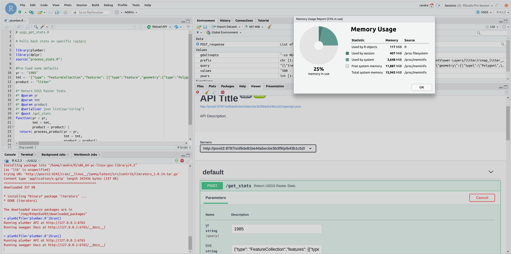
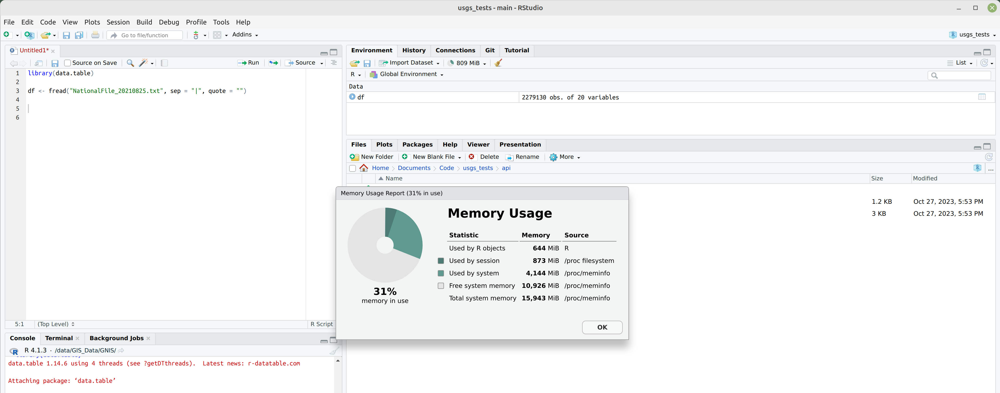

# [SEPM-163](https://positpbc.atlassian.net/browse/SEPM-163): Update the min hardware spec requirements page to be more helpful

Verified: Jan 24, 2024

(Probably should look at getting this added somwhere near, or under - https://solutions.posit.co/architecting/)

### Background

Solutions Engineers are often asked by customers to provide recommendations about what hardware specs would best suit their needs for running Posit Team applications.  While at face value this seems like a reasonable request, the reality of the matter is that in most cases the answer is,  _"it depends"_.  Knowing this, the recommended system requirements found in each product's Administration guides should be viewed as basic starting points, not as a definitive "one-size-fits-all" suggestions.

For example:

* [Workbench](https://docs.posit.co/ide/server-pro/getting_started/requirements.html#recommended-system-requirements): 
	- 4+ CPUs
	- 8+ GB of RAM
	- 100+ GB of disk storage
* [Connect](https://docs.posit.co/connect/admin/getting-started/requirements/): 
	- no min CPU 
	- 4+ GB of RAM
	- 100+ GB of disk storage
* [Package Manager](https://docs.posit.co/rspm/admin/getting-started/requirements/#system-requirements): 
	- no min CPU 
	- 2+ GB of RAM
	- 100+ GB of disk storage
	
Applications will start, run and function properly on servers with these specifications, but there is no guarantee that a customer will be happy with the performance obtained from these.  In order to ensure that performance is acceptable for a specific customer, servers should be specced in a way that takes into account the specific workflows that are unique to that customer.  

This article will go into greater detail about how different workflows and team sizes can affect the resource speccing process.  It is also useful to note, up front, that resource specification is also highly dependent on the manner in which the product is deployed and configured.  This article will only cover single-server and High-Availability deployments.  Deployments into back-ends such as High Performance Computing Clusters and/or Kubernetes will not be addressed.  Please see [this article](https://solutions.posit.co/architecting/) if you have questions about which architecture is right for you.

### Generic Recommendations

As a starting point, [previous articles from Posit](https://support.posit.co/hc/en-us/articles/115002344588-Configuration-and-sizing-recommendations) on this topic have said that "small" teams would be well-served by the following specifications.

* __Workbench:__ "A small, (4 core & 8GB RAM), server will support one or two analysts with tiny data."
* __Connect:__ "A Small, (8 core / 32GB RAM), server will support a small team of data scientists who build small apps and post static documents for 20 end users."
* __Package Manager:__ "One or more servers with a minimum of 2 cores, 4 GB of RAM and 500 GB disk will support multiple repositories."

These recommendations can be used as an easy starting point to extrapolate for larger teams.  For example, let's assume that a team is 2x the size listed above...

> _4 to 5 analysts doing mostly report creation, a few Shiny apps and some machine learning with around 20 end-users viewing published content._

In that case, I could simply double the size of my Workbench instance and leave the Connect and Package Manager specs as-is, thus giving me a new set of specs that look like this:

* __Workbench:__ 8 cores, 16GB RAM
* __Connect:__ 8 cores, 32GB RAM
* __Package Manager:__ 2 cores, 4GB RAM, 500GB Disk

----------------------------

_NOTE: Typically when discussing resource requirements we are looking at 3 main types of resources..._

* _Number and type of CPUs (or cores)_
* _Amount and type or storage available in RAM_
* _Amount and type of storage available on disk_

_...in the example listed above, disk size is only listed for Package Manager.  This is because Package Manager is the only application which has a need for physical disk space, which it uses for storage of cached packages and a few other things.  Technically speaking, Workbench and Connect can function with almost no physical disk allocated to a user, or project, with data stored in off-host databases or other data sources.  That data is stored in RAM while it is being used inside or R or Python, so disk sizing becomes a function entirely of where a team's project data is stored and how they are expected to work with it._

------------------------------

Coming back to the generic sizing recommendation we extrapolated above, would a team be happy with how the performance of these servers?  Well, again _"it depends"_.  Without a doubt, Package Manager would function well on a server with this spec.  But the Workbench and Connect performance would depend on a few things. Let's dive a bit more into what factors affect the performance of each Posit app.

### Workbench Performance Factors

Workbench is a server based development environment that allows users to start IDE sessions in RStudio, VSCode, Jupyter Lab and Jupyter Notebooks.  One or more of these interactive sessions can be run by a single user at the same time.  Additionally, users can run non-interactive Workbench jobs in either R or Python.  _(These non-interactive Workbench jobs are typically used for long-running tasks that can run in the background.)_  

In many ways, Workbench is similar to an analyst's desktop environment but with a key difference being that multiple sessions can be running at the same time.  _(Workbench does have configuration options that can limit the number of sessions a user can launch, as well as specify the max amount of resources an individual session can use, but for now, let's assume a user can launch multiple sessions on the server.)_

With that in mind, the key factors that affect Workbench performance are:

1. __Total number of concurrent and active sessions__
2. __The type of work being done in each session__
3. __The "state" of each session__

#### __Workbench CPU Requirements__

Workbench by itself consumes only only a tiny amount of system resources.  Therefore the number of resources needed for good performance is mostly dictated by the number of R and Python processes running inside of user sessions or in Workbench jobs.  By default, R and Python are both single-threaded processes that hold all their data in memory.  In most cases, having 1 or 2 cores per developer session is sufficient for most analytic workflows.  

* __Workbench CPU Rule-of-Thumb__: _(2_CPUs)_ **X** _(number_of_analysts)_ **X** _(number_of_IDE_sessions)_

This is only true if multi-threading/parallel-computing is not used very often.  In those cases, a core will be used for every worker/thread/process that has been allocated to it.

_NOTE: "number_of_IDE_sessions" should only take into account "active" sessions.  Suspended sessions consume no CPU resources._

#### __Workbench RAM Requirements__

The amount of RAM needed per session on Workbench can vary tremendously and is almost entirely a function of 2 things.

* The size of data being analyzed and the manner in which it is loaded into memory
* The size of data being created and when it is saved

Without going too far down a rabbit hole on this, using programming constructs such as R iterators and Python generators can reduce the amount of data that is loaded into memory at one time.  Also, writing intermediate outputs back to disk, or to a database, can reduce the amount of RAM needed during a processing task.  

__The best way to determine the RAM needed for each user is to profile their work.__   We say this all the time to customers, "open your project and see how much RAM it uses".  For example, below is a Plumber API running in the RStudio IDE.  

...and here is a project that reads in a CSV file from disk.

You can see that the RAM usage in each project is very different from each other. The key is to have enough RAM for each session such that all users have enough available to do their work.  In case Number 1, 1GB RAM per user is probably sufficient.  In case Number 2, 2GB of RAM per user would be better - MINIMUM!  In most cases it is better to have extra RAM than to have extra cores, which is why we almost always recommend at least 4 GB per user.

* __Workbench RAM Rule-of-Thumb__: 2GB RAM __per__ user - minimum.

#### __Workbench Disk Requirements__

We briefly touched on the "squishy" nature of disk requirements in the note block at the beginning of this doc.  We have 3 needs for disk space on Workbench:

1. Space to install the Workbench application code, R and Python interpreters and other integration tools like Quarto and Jupyter
2. Swap space used by the system in place of RAM when all of the system RAM is in use
3. User home directory space used for both projects and user R package libraries

* __Workbench Disk Rule-of-Thumb__: 550MB_root_storage __+__ 8GB_swap __+__ (typical_user_space __X__ number_of_users)

User home directory space is going to vary widely, but let's assume it could be anything from 8GB to 250 GB per user and do the math for our current "4 or 5 analyst" example using both ends of that range.

* 550MB __+__ 8000MB __+__ (5 __X__ 8000MB) = __50GB__  (low end)
* 550MB __+__ 8000MB __+__ (5 __X__ 250000MB) = __1.25TB__ (high end)

Another factor to consider when thinking about disk requirements is the speed and type of disk.  In general, it's preferable for your application code and swap space to be on fast disks, like modern Solid State Drives (SSDs).  User home directories can be on slower disks, since in most cases the data on them is going to be read into RAM when it is accessed.  Given this, and the fact that Workbench allows you to use different mount points for different things, a good option is to have a smaller, fast SSD - say around 120GB in size - for the OS, Workbench etc. (root partition) and a separate, larger disk for user home directories.

#### __Workbench Summary__

* __CPU Rule-of-Thumb:__ (2_CPUs) __X__ (number_of_analysts) __X__ (number_of_IDE_sessions)
* __RAM Rule-of-Thumb:__ 2GB RAM __per__ user - minimum
* __Disk Rule-of-Thumb:__ 550MB_root_storage __+__ 8GB_swap __+__ (typical_user_space __X__ number_of_users)

So for a 4-5 person team, 2 server options that could work well - depending on how the team works are:

* __Option 1.__ 
  - 8 CPU 
  - 8GB RAM 
  - 100GB - 150GB SSD disk
* __Option 2.__ 
  - 16+ CPU
  - 16GB+ RAM
  - 100GB SSD
  - 1TB HD

### Connect Performance Factors

Posit Connect is a server based publishing platform which supports a wide variety of R and Python based content.  It can be used to host and share information in dashboards and reports, as well as host APIs, data and ML models.  Content which is hosted on Connect is deployed into sandboxed, virtual environments which run in isolation from one other. 

Essentially, Connect functions as both a Web server and an Application server.  This means that Connect's hardware specifications will depend on the number and type of applications, documents, and analysis running on the server.  Additionally, the number of concurrent users and the runtime settings of the content they are viewing (where applicable) will have an impact on performance.

Therefore, the key factors that affect Connect's performance are:

1. __The number and types of content running on the server.__
2. __The number of concurrent users on the server.__
3. __The runtime settings of the content__

#### __Connect CPU Requirements__

Connect's CPU utilization will vary based on the type of content that is being viewed.  For example, static content such as RMarkdown of Jupyter notebooks will require very little CPU if it is pre-rendered before being published.  The same documents when published with source code will need additional computing resources when they execute in place (either when published or refreshed).  At that time,  R or Python code in the document will be execute processes on the Connect server.  APIs similarly need processing power available when a request is made through them.  And finally, dashboards such as Shiny or Streamlit require CPU access while they are open during an interactive session.  (NOTE: interactive content will continue to consume resources if the [timeout settings](https://docs.posit.co/connect/user/content-settings/#timeout-configurations) are not properly set as well.)

In summary then, CPU cores will be needed for each of the following tasks:

* execution of R and Python code contained in a Notebook, RMarkdown or Quarto document
* requests made to a hosted API
* interactive Dashboard utilization
* other processing tasks related to running the Connect server

The key point to think about is, "what is running concurrently?".  Although multiple users can be logged into the server doing different things, the number of users by itself may have little impact on the Connect server's performance.  This is why a Development server used for testing can be as small as 2 cores with a small amount of RAM, since only a single user is running things one-at-a-time, in general.

* __Connect CPU Rule-of-Thumb:__ (1 CPU per concurrent processing task) __+__ (1 CPU for background tasks)

--------------------------

_PARALELLIZATION CAVEAT:_ 

_Connect is able to run almost ANY R or Python code that is published to it.  This includes parallelized code that uses multiple cores.  Executing code like this can quickly reduce the amount of available CPU available for other tasks on the machine.  A common example of this type of multi-CPU task would be training an ML model.  If you plan to do this sort of thing on your Connect server, we strongly recommend that you implement either `cgroups` to limit the resources that Connect can use, or some sort of horizontal scaling, either via High Availablily or Off-Host-Execution configurations.  Additional information about scaling and how to plan for it can be found [on our Solutions site](https://solutions.posit.co/admin-training/courses/connect/08_scaling.html#connect-architectures)._

-----------------------------

#### Posit Connect - RAM Requirements

Connect's ability to act as both a Web and Application server means that multiple users can be viewing/using very different content at the same time.  This flexibility also means resource utilization on the server can be quite varied depending on the type of content and the number of concurrent users on the system at one time.  In some ways this is very similar to Workbench and the best way to determine RAM requirements is to profile some of the projects that the team is working on in RStudio.  That being said, a rough guideline for sizing RAM is the following:

* __Connect RAM rule-of-thumb:__ (250MB to 2GB RAM) __X__ number of concurrently open applications

As always, the best way to determine how much RAM your Connect server is to profile the applications that you intend to deploy there.

-----------------------------

_NOTE: It's important to remember that RAM utilization for Connect is most directly tied to data being processed and loaded in the application.  So a static Rmarkdown document will tend to consume much less RAM than a Shiny application which is loading data into RAM for processing while being run._

----------------------------

#### Posit Connect - Disk Requirements

Connect uses disk space to host the built content caches of applications and reports that have been deployed to it, as well as for the on-disk SQLite database and other system related information.  Thus, disk utilization can vary quite a bit depending on the number of deployed applications and the amount of data that accompanies each application.  Put another way, if you attach a 500MB CSV as part of your report deployment, Connect will need space on disk to store that data.  Additionally, if you publish updates regularly to a piece of content, Connect will retain the old versions as well as the new ones.  The amount of retention is configurable and discussed a bit in this [Support article](https://support.posit.co/hc/en-us/articles/8973648011543-Posit-Connect-Reclaim-Disk-Space).

In summary, the main utilization of disk space on Connect is for:

* Built content caches (both current and historic)
* Installed code for the R, Python and Quarto implementations used by content

Given the variability in what content, and how often it is published, it is difficult to predict a minimum disk size that is adequate for all users.  For that reason, we recommend no less than 100GB of disk on the Connect server.

* __Connect Disk rule-of-thumb:__ 100GB, minimum.

---------------------------------------

_NOTE: It should be assumed that as users come and go through the organization, they will publish content that will need to persist on the server after they have left.  For that reason it is best to allocate slightly more disk than is needed initially, to allow for growth of the cached content over time._

----------------------------------------

### Package Manager Performance Factors

Unlike other Posit products, Posit Package Manager focuses on storing and organizing packages not running computations. For that reason, disk space is the most important consideration for Posit Package Manager as opposed to CPU and RAM.  Some good initial resource specs might be:

* Minimum (2 core / 2G of RAM / 200 GB disk).
* Recommended (2 core, 4 GB of RAM, 500 GB disk). 

The Minimum configuration can support a single small team that is working primarily in R or Python with one configured Package Manager repository.  The Recommended configuration can support multiple repositories and can be used by a team or even multiple departments. See the admin guide for details on storage requirements, as they may vary in air-gapped environments or in cases where multiple operating systems and R versions are required.

#### __Package Manager CPU Requirements__

#### __Package Manager RAM Requirements__

#### __Package Manager Disk Requirements__
